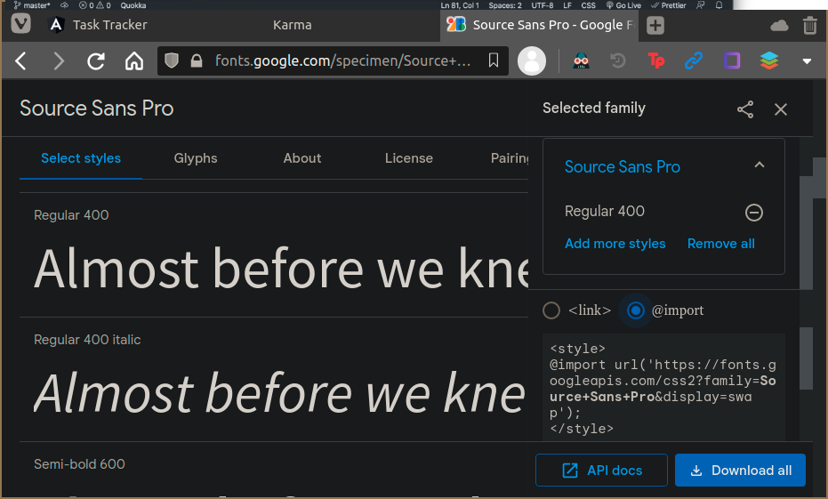
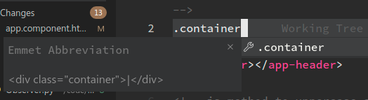

Time tracker for angular crash course
---

# Import fonts from google
[Example](https://fonts.google.com/specimen/Source+Sans+Pro?query=source+sans)

```scss
@import url('https://fonts.googleapis.com/css2?family=Source+Sans+Pro&display=swap');
```


# Auto-generated readme
Readme generated with the CLI after:
```sh
ng new angular-crash
```

# Misc
## Create divs with emmet abreviation


## Add component with ng
```sh
ng add @fortawesome/angular-fontawesome
```


> # AngularCrash
> 
> This project was generated with [Angular CLI](https://github.com/angular/angular-cli) version 10.2.0.
> 
> ## Development server
> 
> Run `ng serve` for a dev server. Navigate to `http://localhost:4200/`. The app will automatically reload if you change any of the source files.
> 
> ## Code scaffolding
> 
> Run `ng generate component component-name` to generate a new component. You can also use `ng generate directive|pipe|service|class|guard|interface|enum|module`.
> 
> ## Build
> 
> Run `ng build` to build the project. The build artifacts will be stored in the `dist/` directory. Use the `--prod` flag for a production build.
> 
> ## Running unit tests
> 
> Run `ng test` to execute the unit tests via [Karma](https://karma-runner.github.io).
> 
> ## Running end-to-end tests
> 
> Run `ng e2e` to execute the end-to-end tests via [Protractor](http://www.protractortest.org/).
> 
> ## Further help
> 
> To get more help on the Angular CLI use `ng help` or go check out the [Angular CLI Overview and Command Reference](https://angular.io/cli) page.
